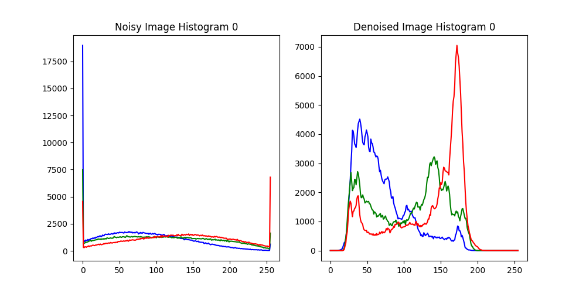

# 北京邮电大学计算机学院人工智能原理深度学习项目实践-图像去噪

## 如果能帮助到您，希望您能给个star⭐️，万分感谢！

## 项目要求：使用神经网络或空间滤波方法去除图像中添加的高斯噪声

## 项目数据：
- Train：Train文件夹中包含两部分数据，包括原始origin图像和加了噪声之后的noise图像，可以用于训练。
- Test：Test中包含部分添加了高斯噪声的图像，请使用你的方法对照片进行去噪处理。
【链接: https://pan.baidu.com/s/1TNzI3-ekMOYKhkaSHKOUaQ?pwd=t59h 提取码: t59h】

## 评价指标：使用PSNR等指标比较Test文件夹中去噪前后的图像差异

# 深度学习项目实践-图像去噪 实验报告

## 一、设计思路

#### 设计模型
- 尽量选择性能高的模型
- 模型选择时，要考虑模型的复杂度和性能
- 模型选择时，要考虑模型的泛化能力
- 模型选择时，要考虑有限的计算资源

#### 训练模型
- 训练模型时，要根据数据集的特点选择合适的损失函数和优化器。
- 训练时，要选择合适的训练轮数和批次大小。
- 训练过程中，要观察损失函数的变化趋势和模型性能的变化情况。
- 训练模型时，不断改进模型
#### 保存模型
- 保存模型，为预测或者进一步训练提供保证
- 在训练途中保存表现较好的模型，以便在需要时使用。
- 保存模型时，只保存模型的参数，减轻负载。
#### 预测结果
- 预测结果，并保存
- 设计一个预测系统，对测试集中的图像进行预测
#### 评估结果
- 设计评估系统，对实验结果进行评估
- 使用多种评估方法：
    - **视觉分析**
    - **图表分析**
    - **熵值分析**
    - **`NIQE`分析**
#### 实验环境
- 使用 `PyTorch` 框架进行实验
- 使用 `CUDA` 加速训练过程
- 使用 `GPU` 进行训练
- 使用 `TensorBoard` 进行可视化
- 使用 `OpenCV`&`PIL` 进行图像处理
- 使用 `Linux` 服务器进行模型训练
- 使用 `Windows` 操作系统进行模型预测

## 二、实验流程

### 1. 数据集准备

- 数据集使用项目所提供的 Data 文件夹中的 Train 数据集 （共 `4000+` 张图片）。
- 数据集地址：https://pan.baidu.com/s/1TNzI3-ekMOYKhkaSHKOUaQ?pwd=t59h

#### 自定义数据集类
设计一个自定义的数据集类 `CustomImageDataset`，继承自 PyTorch 的 `Dataset` 类。这个类专门用于加载和处理图像数据，特别是用于图像去噪等任务的训练数据。以下是对该类的详细描述：

- **初始化方法 (`__init__`)**

    - **参数**：
        - `train_dir`：包含训练数据的目录路径。
        - `transform`：可选的图像变换函数或组合，用于对加载的图像进行预处理。

    - **功能**：
        - 将 `train_dir` 下的 `origin` 和 `noise` 两个子目录中的图像文件路径分别存储到 `self.origin_paths` 和 `self.noise_paths` 列表中。
        - 这两个列表中的路径通过 `os.listdir` 函数获取，并使用 `os.path.join` 组合成完整路径。
        - 对路径列表进行排序，以确保在加载图像时，原始图像和噪声图像之间的对应关系是一致的。
        - 存储传入的图像变换函数，以便在获取图像时应用。

- **获取数据集长度 (`__len__`)**

    - 返回数据集中图像对的数量，即原始图像或噪声图像的数量。这个数量等于 `self.origin_paths` 或 `self.noise_paths` 的长度。

- **获取数据集元素 (`__getitem__`)**

    - **参数**：
        - `idx`：数据集中样本的索引。

    - **功能**：
        - 根据索引 `idx` 从 `self.origin_paths` 和 `self.noise_paths` 中读取对应的原始图像和噪声图像。
        - 使用 OpenCV 的 `cv2.imread` 函数加载图像。加载后的图像是 BGR 格式。
        - 使用 `cv2.cvtColor` 将图像从 BGR 格式转换为 RGB 格式，因为 RGB 是更常用的图像格式，特别是在深度学习中。
        - 如果指定了 `transform`，则对加载的原始图像和噪声图像分别应用该变换。这通常用于图像的标准化、尺寸调整等预处理操作。
        - 返回一个元组 `(noise_img, origin_img)`，即噪声图像和对应的原始图像。

### 2. 模型选择

- 选择了由**编码器**和**解码器**组成的**深度学习**模型。

#### 编码器

编码器部分负责从输入图像中提取特征，减少其空间维度，同时增加深度（通道数）。以下是编码器中每一层的详细说明：

1. **第一卷积层 (`nn.Conv2d(3, 64, ...)`)**：
   - **输入通道数**：3（假设是RGB图像）。
   - **输出通道数**：64。
   - **卷积核大小**：3x3。
   - **步幅**：1。
   - **填充**：1（保持空间尺寸不变）。
   - 这一层将深度从3增加到64个通道。

2. **批量归一化 (`nn.BatchNorm2d(64)`)**：
   - 对卷积输出进行归一化，以提高训练的稳定性和性能。

3. **ReLU激活函数 (`nn.ReLU(inplace=True)`)**：
   - 应用ReLU激活函数以引入非线性。

4. **后续卷积层**：
   - 每个后续的`nn.Conv2d`层遵循相同的模式，将通道数从64增加到128，再从128增加到256，最后从256增加到512，同时由于填充保持相同的空间尺寸。
   - 每层之后都有一个`BatchNorm2d`和`ReLU`激活。

5. **最大池化 (`nn.MaxPool2d(kernel_size=2, stride=2)`)**：
   - 将空间尺寸减少一半，有效地对特征图进行下采样。

#### 解码器

解码器从编码的特征中重建图像。它旨在恢复原始尺寸，并将深度减少回原始通道数（RGB图像为3）。

1. **第一反卷积层 (`nn.ConvTranspose2d(512, 512, ...)`)**：
   - **输入通道数**：512。
   - **输出通道数**：512。
   - **卷积核大小**：2x2。
   - **步幅**：2。
   - 这一层对特征图进行上采样，将其空间尺寸加倍。

2. **批量归一化和ReLU**：
   - 与编码器类似，每个反卷积层之后都有批量归一化和ReLU激活。

3. **后续卷积层**：
   - 通道数通过`nn.Conv2d`层从512减少到256，从256减少到128，再从128减少到64。
   - 每层之后都有批量归一化和ReLU激活。

4. **最终卷积层 (`nn.Conv2d(64, 3, ...)`)**：
   - 将深度减少回3个通道，与输入图像的通道数相匹配。

5. **Sigmoid激活函数 (`nn.Sigmoid()`)**：
   - 应用Sigmoid激活函数，将输出像素值限制在[0, 1]范围内，这是图像数据的典型做法。

#### 整体功能

- 这个模型的结构类似于深度学习项目 `DnCNN`。编码器将输入图像压缩到一个低维特征空间，而解码器尝试从这个表示中重建原始图像。它可以用于图像去噪等任务，目标是在去除图像噪声的同时尽可能保留原始细节。
- 通过一系列卷积和反卷积操作，从输入图像中提取特征并重建图像。它利用批量归一化和ReLU激活来提高训练的稳定性和性能，并通过Sigmoid激活函数生成具有有效像素值的输出图像。这种模型架构在图像到图像的转换任务中表现出色，能够学习复杂的特征表示并生成高质量的输出图像。

#### 结构图示
- 模型分为两个部分，分别是 `encoder` 和 `decoder`

- `encoder` 包含`12`层

- `decoder` 包含 `13` 层。最后，`decoder` 输出一个与输入图像大小相同的图像

### 3. 损失函数选择
- 损失函数选择的是均方误差（`MSE`），即预测图像和真实图像之间的差异。

### 4. 优化器选择
- 优化器选择的是 `Adam`，这是一种自适应学习率的优化器，可以加速训练过程。

### 5. 训练过程

#### 设置

1. **设备配置**：
   - 检查是否有GPU可用，如果有，则将设备设置为CUDA（GPU）；否则，默认为CPU。这确保了在可用时，训练过程可以利用硬件加速。

2. **数据准备**：
   - 图像通过一系列转换进行处理：转换为PIL图像，调整大小为256x256像素，并转换为值在[0, 1]范围内的张量。
   - 使用自定义数据集`CustomImageDataset`，该数据集可能用于处理图像加载和预处理。
   - 创建了一个`DataLoader`，批量大小为16（计算资源有限），并对数据进行打乱，以确保训练期间输入顺序的多样性。

#### 模型、损失和优化器

3. **模型初始化**：
   - 创建`Model`类的一个实例，并将其移动到指定的设备（GPU或CPU）。

4. **损失函数**：
   - 使用均方误差（MSE）损失，这对于像图像重建这样的任务是合适的，目标是最小化预测图像和目标图像之间的差异。

5. **优化器**：
   - 选择了Adam优化器，默认初始学习率，这是一个常用的自适应学习率算法。

6. **学习率调度器**：
   - 使用`ReduceLROnPlateau`调度器，根据验证损失调整学习率。如果损失在指定的几个周期（`patience`）内没有改善，则学习率减少0.5倍。

#### 训练循环

7. **周期循环**：
   - 模型最多训练1000个周期，并设置了早停条件以在必要时提前停止训练（计算资源有限，一个周期训练时长为 `8 min`）。

8. **批量循环**：
   - 对于每批次的噪声图像和原始图像：
     - 数据被移动到指定的设备。
     - 使用`optimizer.zero_grad()`重置梯度。
     - 模型对噪声图像进行预测。
     - 使用损失函数（MSE）计算损失。
     - 执行反向传播（`loss.backward()`）以计算梯度。
     - 优化器更新模型参数（`optimizer.step()`）。

9. **损失计算**：
   - 累积每个周期的运行损失，并在所有批次上取平均值。

10. **学习率调整**：
    - 调度器根据平均损失更新学习率。

11. **模型检查点**：
    - 如果当前周期的损失低于记录的最佳损失，则将模型状态保存为`Best_Checkpoint.pth`。
    - 在所有周期完成或触发早停后，将模型状态保存为`Final_Checkpoint.pth`。

#### 早停

12. **早停**：
    - 如果平均损失低于阈值（`early_stop_threshold`），则提前退出训练循环，防止过拟合和不必要的计算。

#### 最终模型保存

13. **模型保存**：
    - 在训练结束时保存模型状态，确保无论是否触发早停，都可以获得最终训练的模型。

## 三、 实验结果及分析

### 1. 模型表现

- 模型训练时间较为漫长，虽然代码中是训练 `1000` 个周期，但最终版本的模型实际训练周期只有 `200` 个左右。
- 模型在训练过程中，损失值逐渐下降，最后降至 `0.0015` 左右。

### 2. 实验结果产生

#### 选择测试集
- 测试集使用项目所提供的 Data 文件夹中的 Test/noise 数据集 （共 `512` 张图片）。
- 测试集地址：https://pan.baidu.com/s/1TNzI3-ekMOYKhkaSHKOUaQ?pwd=t59h
#### 使用训练好的模型进行预测
- 将测试集处理后输入模型进行预测，得到去噪后的图片。
- 图片保存于 `./Data/Test/denoise` 中

### 3. 实验结果展示及分析

#### 实验结果展示

#### 视觉分析

- 以上四张图片是 512 张测试图片进行预测后的结果，将原始噪声图片和预测去噪后的图片都放入 `tensorboard` 中进行对比，可以看到预测的去噪效果良好

##### 放大照片对比：

##### 单张照片对比

#### 图表分析

##### 单表对比

##### 分析说明
- 这个图表是噪声图和去噪图的颜色直方图，用于比较去噪图像和噪声图像的颜色分布。颜色直方图是图像中每个颜色通道（通常是红色、绿色和蓝色）中像素值的分布图。通过比较去噪图像和噪声图像的颜色直方图，我们可以观察到以下潜在的区别：

1. **直方图的集中度**：
   - **噪声图像**：由于噪声的存在，像素值会更分散，直方图更平坦或更宽，这意味着像素值分布在更广的范围内。
   - **去噪图像**：去噪处理通常会使像素值更加集中，直方图变得更尖锐或更窄，表示像素值分布在一个更窄的范围内。。

2 **直方图的杂乱程度**
   - **噪声图像**：由于噪声的存在，直方图十分平缓，原先的色彩有一定程度的缺失。
   - **去噪图像**：去噪处理通常会恢复原图像的色彩，所以直方图会显得更加杂乱。

#### 熵值分析

- 比较噪声图像与去噪图像的平均熵值。熵在信息论中是一个度量图像中信息量或不确定性的指标。熵值越高，表示图像中信息量越大或者说不确定性越高。：

1. **噪声图像的平均熵（7.8567650983258）**：
   - 噪声图像通常具有较高的熵，因为噪声引入了随机性和不确定性，增加了图像的复杂性和信息量。

2. **去噪图像的平均熵（7.289841962511361）**：
   - 去噪图像的熵较低，这通常是因为去噪过程减少了图像中的随机性和不确定性。去噪算法的目标是去除噪声，同时尽量保留图像的有用信息。

**比较**：
- 熵值的减少表明去噪算法有效地降低了图像的随机性和不确定性，清除了噪声。
- 理想情况下，去噪后的图像应该在降低熵值的同时保持图像的细节和重要特征。

#### `NIQE` 值分析

- 比较去噪图像和噪声图像的 **NIQE**（Natural Image Quality Evaluator，自然图像质量评价）值是为了评估去噪算法对图像质量的影响。NIQE是一种无参考图像质量评价指标，它不需要原始无噪声图像作为参考，通过统计分析图像的自然特征来评估图像质量。

- 通过比较去噪前后的 **NIQE** 值，可以判断去噪算法在提高图像质量方面的有效性。通常情况下，去噪图像的 **NIQE** 值应该低于噪声图像，因为去噪处理应该改善图像的视觉质量。

- 可以看出，去噪后的图像的 **NIQE** 值明显低于噪声图像，表明去噪成功。

## 四、 遇到的问题及解决方案

### 1. 问题一

#### 问题
- 在训练过程中，发现损失值在训练过程中没有明显下降，训练时间过长。

#### 解决方案
- 检查代码，发现训练过程中没有设置学习率调度器，导致学习率没有动态调整，训练过程缓慢。
- 添加学习率调度器，根据验证损失动态调整学习率，提高训练效率。

### 2. 问题二

#### 问题
- 在训练过程中，发现模型在训练过程中没有明显的过拟合现象，但最终模型的预测效果并不理想。

#### 解决方案
- 检查代码，发现训练过程中没有设置早停条件，导致训练时间过长。
- 添加早停条件，当验证损失在指定周期内没有明显下降时，提前停止训练，防止过拟合。

### 3. 问题三

#### 问题
- 在训练过程中，找不到合适的神经网络结构，导致模型预测效果不佳。

#### 解决方案
- 检查代码，发现模型结构过于简单，导致模型无法有效学习图像特征。
- 修改模型结构，添加更多的卷积层和BN层，提高模型的表达能力。

### 4. 问题四

#### 问题
- 计算资源有限，导致训练时间过长。

#### 解决方案
- 使用GPU加速训练，提高训练速度。
- 优化代码，减少 `batch_size`，防止 GPU 显存不足。

## 五、 总结

### 1. 实验总结

- 本次实验通过使用深度学习技术，对噪声图像进行去噪处理，取得了较好的效果。
- 实验结果表明，该模型能够有效地去除噪声并保留原始图像的细节和特征。
- 实验过程中，通过不断调整模型结构和训练策略，提高了模型的性能和预测效果。

### 2. 实验反思

- 本次实验中，我深入了解了深度学习技术在图像去噪领域的应用，掌握了卷积神经网络的基本原理和实现方法。
- 在实验过程中，我遇到了一些问题，如训练时间过长、模型预测效果不佳等，通过不断调整和优化，最终取得了较好的结果。
- 在未来的实验中，我将继续学习和探索深度学习技术，提高自己的编程能力和解决问题的能力。

### 3. 实验收获

- 通过本次实验，我深入了解了深度学习技术在图像去噪领域的应用，掌握了卷积神经网络的基本原理和实现方法。
- 通过实验，我学会了如何使用 PyTorch 框架进行深度学习模型的训练和预测，提高了自己的编程能力和解决问题的能力。